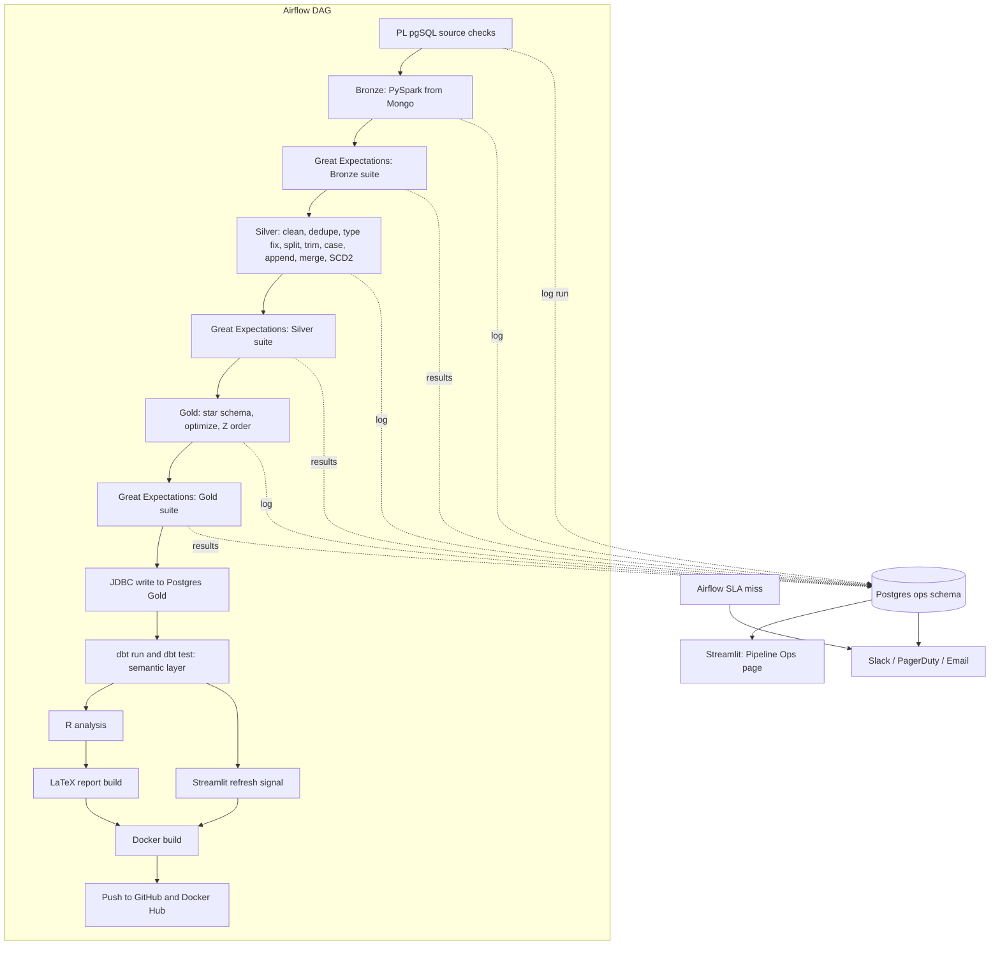

# Lotus Retail Lakehouse — Architecture

Source data: the Lotus Retail Dataset, a fictional Egypt retail dataset, 9 tables, 42,877 rows, January 2022 to December 2024, star schema shaped, with intentionally embedded data quality issues (duplicates, missing values, wrong types, columns needing a split, untrimmed text, inconsistent casing, two fact_orders tables that need appending, a returns table that needs merging against order details). All 9 tables are already loaded into MongoDB, one collection per table.

This version adds the layer of maturity that separates a portfolio pipeline from something closer to production: a real orchestration DAG, idempotent and rerunnable writes, schema evolution handling, lineage, a semantic layer, formal SLAs, a Type 2 SCD strategy on the dimensions that need it, secrets management, environment separation, alert routing, backup/DR policy, and compute cost governance.

## 1. Where each engine sits

- **MongoDB is the raw landing zone.** It holds the 9 collections exactly as loaded, untouched. Nothing writes back into Mongo.
- **Databricks is the transform engine.** Every PySpark job, Bronze ingestion, Silver cleaning, Gold star schema build, quality checkpoints, optimization passes, all of it runs here against Delta tables.
- **PostgreSQL is the serving warehouse plus the operations store.** Gold lands here for Streamlit, R, dbt, and the PL/pgSQL quality loops to read, and a separate `ops` schema tracks pipeline runs, quality results, schema changes, and alerts.
- **Apache Airflow is the control plane.** It is the piece that was missing before. Databricks Workflows alone can trigger Spark jobs, but this pipeline also has a Postgres side (PL/pgSQL checks), an R and LaTeX side, and a Docker build and publish side, none of which are Databricks tasks. Airflow is where all of that becomes one DAG with real dependency ordering, retries, backfills, and alert routing, rather than a chain of shell scripts hoping the previous one succeeded.
- **A secrets backend (HashiCorp Vault, or the cloud-native equivalent — AWS Secrets Manager / Azure Key Vault) is the credential store.** No live credential lives in a `.env` file, a DAG file, or source control past local development. See Section 10.

## 2. High level flow



Every box is now an Airflow task with its own retry policy and timeout, not a step inside one long script. A failure at Silver retries twice on its own before it halts the DAG, shows up as failed in `ops.pipeline_runs`, and fires an alert (Section 12).

## 3. Orchestration: Airflow as the master DAG

Airflow owns scheduling, dependency ordering, retries, and backfills. It calls into the same shell scripts and Python modules as before, it does not replace them, it just stops treating "run everything in sequence and hope" as the orchestration strategy:

- `DatabricksSubmitRunOperator` (or `DatabricksRunNowOperator` against an existing job) triggers the Bronze, Silver, and Gold PySpark jobs on the cluster, Airflow only waits on job status, Databricks still does the compute.
- `PostgresOperator` runs the PL/pgSQL source quality loops before ingestion even starts.
- `PythonOperator` tasks run the Great Expectations checkpoints and push results into `ops.quality_results`.
- `BashOperator` tasks run `dbt run`, `dbt test`, the R render, the `latexmk` build, and the Docker build and push.
- Each task gets `retries=2` with exponential backoff and a `sla` parameter, so a transient Mongo connection blip or a slow Databricks cluster start does not fail the whole run, and a task that blows past its expected duration raises an SLA miss that Airflow surfaces on its own, independent of the custom Streamlit ops page, and also routed to the alert channel (Section 12).
- Backfills become a one line Airflow CLI command against a date range instead of a manual rerun of `run_all.sh`, which matters the day you need to reprocess three months of history after a Silver bug fix.
- The DAG is parameterized by environment (`dev`, `staging`, `prod`) via an Airflow Variable rather than hardcoded — see Section 11.
- All credentials the operators need (Mongo URI, Databricks token, Postgres DSN, dbt profile secrets) are resolved through Airflow Connections backed by the secrets backend, never read from a plaintext file at DAG parse time (Section 10).

## 4. Idempotency and safe reruns

Every write in the pipeline is designed so running it twice produces the same result as running it once, this is what makes retries and backfills safe instead of dangerous:

- Bronze uses `MERGE INTO` keyed on the source primary key rather than a blind overwrite, so a retried extract does not duplicate rows.
- Silver and Gold writes are also `MERGE` based, keyed on the natural business key (`order_id`, `customer_id`, and so on) for Type 1 tables, and keyed on the natural key plus effective-dating logic for the two Type 2 dimensions (Section 7), with a `_batch_id` column so a specific run can be identified and, if needed, rolled back using Delta time travel.
- The Mongo extract tracks the last successfully processed document range in `ops.extract_checkpoints`, so a job that dies halfway through a large collection resumes from the checkpoint on retry instead of reading everything again.

## 5. Bronze layer, with schema evolution handling

One Delta table per Mongo collection, read with the Mongo Spark connector:

```python
df = (
    spark.read.format("mongodb")
    .option(
        "connection.uri", mongo_uri
    )  # resolved from Airflow Connection / secrets backend
    .option("database", "lotus_retail")
    .option("collection", "dim_customers")
    .load()
)
df.write.format("delta").option("mergeSchema", "true").mode("overwrite").saveAsTable(
    "bronze.dim_customers"
)
```

`mergeSchema` matters here specifically because Mongo documents do not enforce a fixed shape the way a relational table does, a future load with an extra field should not break the pipeline. Any schema change gets logged to `ops.schema_changes` (table, column, change type, detected at) so it shows up in the monitoring page rather than silently changing downstream behavior.

Nine Bronze tables: `dim_date`, `dim_stores`, `dim_customers`, `dim_employees`, `dim_products`, `fact_orders_2022_2023`, `fact_orders_2024`, `fact_order_details`, `fact_returns`.

## 6. Silver layer

Each of the dataset's built in data quality issues becomes a PySpark transform function, unit tested in isolation:

| Issue | Table | PySpark approach |
|---|---|---|
| Duplicates | dim_customers | `dropDuplicates` on the natural key |
| Missing values | dim_customers, fact_orders | `fillna` for safe defaults, drop only where a required key is missing |
| Wrong data types | dim_customers, dim_products | explicit `.cast()` calls |
| Columns needing a split | dim_customers, dim_products | `split()` plus `getItem()` |
| Untrimmed text | dim_customers, fact_orders | `trim()` applied generically |
| Inconsistent case | dim_customers | `initcap()` or `upper()` |
| Two fact_orders tables | fact_orders_2022_2023 + fact_orders_2024 | `unionByName` into `silver.fact_orders` |
| Returns needing enrichment | fact_returns against fact_order_details | left join on order and product keys |
| Historical attribute changes | dim_customers, dim_employees | SCD Type 2 versioning, see Section 7 |

Output: `silver.dim_customers`, `silver.dim_products`, `silver.dim_stores`, `silver.dim_employees`, `silver.dim_date`, `silver.fact_orders`, `silver.fact_returns`.

## 7. Slowly Changing Dimensions

Straight `MERGE`-on-natural-key (SCD Type 1) is the default and is fine for attributes where only the current value ever matters. Two dimensions get upgraded to Type 2 because losing history on them would break correctness of historical fact analysis, not just cosmetic reporting:

| Dimension | Strategy | Reasoning |
|---|---|---|
| `dim_customers` | **Type 2** on region/segment/tier | "What region was this customer in when the order was placed?" is a real, expected query. Type 1 silently rewrites the past. |
| `dim_employees` | **Type 2** on store assignment/department | An employee moving stores should not retroactively reassign historical orders to their new store. |
| `dim_products` | Type 1 | Attribute corrections (fixed typo, corrected category) should apply retroactively; there's no meaningful "as of order date" product question here. |
| `dim_stores` | Type 1 | Store attributes are effectively static for this dataset's timeframe. |
| `dim_date` | N/A | Static calendar dimension, generated once. |

Implementation for the two Type 2 dimensions:

- A surrogate key (`customer_sk`, `employee_sk`) generated at Silver, separate from the natural business key (`customer_id`, `employee_id`).
- `effective_start_date`, `effective_end_date` (null while current), and `is_current` boolean.
- A hash of the tracked attributes (`attribute_hash`) computed per row; the Silver `MERGE` compares incoming hash against the current row's hash — unchanged rows are a no-op, a changed hash closes out the old row (`effective_end_date = current_date`, `is_current = false`) and inserts a new one (`is_current = true`).
- `silver.fact_orders` and Gold's `fact_orders` join to the dimension **as of the order date** (`effective_start_date <= order_date < coalesce(effective_end_date, '9999-12-31')`) rather than joining on the natural key alone, so historical facts always resolve to the customer/employee state that was true at the time.
- `mart_revenue_by_store_month` and similar marts are built against this point-in-time join, so a store reassignment does not silently reshuffle historical revenue attribution.

This is also the piece worth being able to explain out loud in an interview: Type 1 is simpler and is the right default; Type 2 is the deliberate exception applied only where "as of" correctness actually matters for the fact tables that reference it.

## 8. Gold layer

- `dim_date`, `dim_stores`, `dim_customers` (SCD2), `dim_employees` (SCD2), `dim_products`
- `fact_orders`, `fact_returns`
- `mart_revenue_by_store_month`, `mart_return_rate_by_product`, `mart_ramadan_seasonality`

Optimization before the Postgres write: `OPTIMIZE fact_orders ZORDER BY (store_id, order_date)`, broadcast joins for the small dimensions, adaptive query execution on throughout, salting only if a store turns out to dominate order volume enough to skew the join.

## 9. Postgres serving warehouse and the semantic layer

PySpark writes Gold to Postgres over JDBC. On top of that raw Gold copy, dbt owns one governed definition of every business metric, this is the piece that stops two dashboards from quietly disagreeing on what revenue means:

```
models/
  marts/
    revenue_by_store_month.sql
    return_rate_by_product.sql
    ramadan_seasonality.sql
schema.yml   # column tests: not_null, unique, relationships
```

`dbt run` builds the marts as views or tables inside Postgres, `dbt test` checks not null, uniqueness, and foreign key relationships as a second, SQL native layer of validation alongside Great Expectations, and `dbt docs serve` generates the lineage graph from source table to mart, which doubles as living documentation of the whole warehouse. The PL/pgSQL read only loops still run separately against the raw Gold tables, they check things dbt tests do not, like future order dates and negative return amounts.

Streamlit and R connect through a connection pooler (PgBouncer) rather than directly against Postgres, so ad hoc dashboard queries don't compete one-for-one with the JDBC batch write and the dbt run for connection slots during a pipeline run.

## 10. Security, secrets, and governance

- **No live credential in a file.** `.env` (see `.env.example`) exists only to bootstrap local development against local/sandbox resources. Staging and production credentials — Mongo URI, Databricks token, Postgres DSNs, dbt profile secrets, Docker Hub/GHCR tokens, the alert webhook — live in the secrets backend and are exposed to Airflow as Connections/Variables, and to Databricks jobs as secret scopes. Nothing in `dags/`, `src/`, or `dbt/` ever contains a raw secret.
- **PII handling.** `dim_customers` carries the only meaningful PII in this dataset (name, contact fields). Postgres exposes a masked view (`gold.dim_customers_masked`, e.g. name initials + hashed email) to Streamlit and general BI roles; the unmasked table is restricted to a narrow `pii_reader` role used only by the ops/admin path. This is enforced with Postgres `GRANT`/`REVOKE` and row/column-level security, not by convention.
- **Encryption.** Postgres and the Delta storage layer both use encryption at rest (cloud-provider default); JDBC and Mongo connections use TLS.
- **Least privilege.** Airflow's Databricks/Postgres connections use service accounts scoped to only the schemas/catalogs each task touches (Bronze write role can't touch Gold, for example), not one shared superuser credential.

## 11. Environments

Three environments — `dev`, `staging`, `prod` — share the same DAG and codebase, parameterized rather than forked:

- Separate Databricks catalogs (or workspaces) per environment: `dev_bronze`/`dev_silver`/`dev_gold`, etc.
- Separate Postgres databases (or at minimum separate schemas) for Gold and `ops` per environment.
- An Airflow Variable (`LOTUS_ENV`) selects which set of Connections and catalog/schema names a DAG run resolves against; the DAG code itself does not change between environments.
- A Silver transform change is validated in `dev` (small/sampled data), promoted to `staging` (full data, no downstream consumers pointed at it), and only then promoted to `prod` — this is what makes the CI/CD process in Section 15 meaningful rather than "merge and hope."

## 12. Monitoring, alerting, and SLAs

Two tables in the Postgres `ops` schema:

```sql
create table ops.pipeline_runs (
    run_id uuid,
    task_name text,
    status text,
    started_at timestamptz,
    ended_at timestamptz,
    rows_in bigint,
    rows_out bigint,
    error_message text
);

create table ops.quality_results (
    run_id uuid,
    suite_name text,
    success_percent numeric,
    failed_expectations int,
    checked_at timestamptz
);
```

Every Airflow task writes a `running` row on start and updates it on completion. Every Great Expectations checkpoint and every `dbt test` run writes its pass rate into `quality_results`. On top of that, a few concrete SLAs give the monitoring page something to measure against rather than just showing green or red:

- Gold refreshed by 7 AM IST on days the DAG is scheduled to run.
- 95 percent of DAG runs complete within 30 minutes end to end.
- No task retries more than twice before the run is marked failed and alerts fire.

**Alert routing.** A pipeline run marked `failed`, a quality suite dropping below its pass-rate threshold, an Airflow SLA miss, or a `schema_changes` insert all fire a Slack message (and, for a hard failure, a PagerDuty page) via a shared `notify_on_failure` callback registered on every task — this is distinct from the Streamlit ops page, which is for browsing history, not for being woken up at 2 AM.

The Streamlit ops page (`pages/ops.py`) reads only these two tables plus `schema_changes`: task status badges, a duration chart per task, a row count trend so a silent drop is visible, the quality and dbt test pass rate over time, and a freshness banner that turns red once Gold is older than the SLA allows.

## 13. Reliability, backup, and disaster recovery

- **Delta retention.** `VACUUM` runs on a schedule with a retention window long enough to cover the time-travel rollback described in Section 4 (default 7 days, extended for Gold), so cleanup doesn't silently remove the version you'd need to roll back to.
- **Postgres backups.** Automated daily snapshots plus point-in-time recovery (WAL archiving) on both the Gold database and, critically, the `ops` schema — `ops` is the pipeline's own source of truth for run history and quality results, and losing it blinds the monitoring page even if Gold itself is fine.
- **Recovery drill.** A documented runbook (`runbooks/restore.md`) for "Gold table corrupted" (Delta time travel restore) and "ops database lost" (PITR restore) scenarios, exercised at least once rather than assumed to work.

## 14. Compute governance and cost controls

- Databricks jobs run on **job clusters** (spin up, run, terminate) rather than an always-on all-purpose cluster, with autoscaling bounds set per job size.
- A cluster policy caps max workers and enforces spot/on-demand mix, so a bad backfill parameter can't accidentally spin up an unbounded cluster.
- Tags (`env`, `pipeline=lotus`, `layer=bronze|silver|gold`) on every cluster and job for cost attribution.

## 15. CI/CD and testing

`.github/workflows/ci.yml` runs on every PR:

- `pytest tests/unit` — the per-issue Silver transform functions.
- `pytest tests/smoke` — quick end-to-end run against a sampled dataset in `dev`.
- **DAG integrity tests** (new): import the DAG file and assert no import errors, no cycles, every task has `retries` and either an `sla` or an explicit owner-acknowledged exemption, and no task is missing from the dependency graph. This catches the class of bug that only shows up when Airflow tries to parse the DAG in production.
- `dbt run`/`dbt test` against a `staging`-like ephemeral schema.
- Docker image build (not push) to confirm the image still builds.

Merge to `main` promotes through `staging` (Section 11) before a manual/gated promotion to `prod`.

## 16. Repository layout

```
lotus-lakehouse/
  dags/
    lotus_pipeline_dag.py     # the Airflow DAG described in section 3
  src/
    ingest/                   # mongo.py, checkpoint tracking
    silver/                   # one file per data quality issue, scd2.py for Type 2 logic
    gold/                     # star schema and mart builders
    quality/                  # Great Expectations suite definitions
    ops/                      # pipeline_runs, quality_results, schema_changes, alert callback
  dbt/
    models/marts/
    schema.yml
  sql/
    plpgsql_checks/
    ops_schema.sql
    security/                 # roles, grants, masked views
  r/
    analysis.Rmd
  scripts/
    run_ingest.sh
    run_silver.sh
    run_gold.sh
    run_quality_gate.sh
    run_report.sh
  dashboard/
    app.py
    pages/
      ops.py
  runbooks/
    restore.md                # Delta time-travel and Postgres PITR recovery steps
  tests/
    smoke/
    unit/
    dag/                       # DAG integrity tests
  docker/
    docker-compose.yml
    Dockerfile.pipeline
    Dockerfile.dashboard
    Dockerfile.report
    Dockerfile.airflow
    entrypoint.sh
    postgres/init/
    mongo/init/
    mongo/seed.sh
  .github/workflows/ci.yml
  .env.example
  ARCHITECTURE.md
  README.md
  CHANGELOG.md
```

## 17. Tech stack summary

| Concern | Tool |
|---|---|
| Raw landing | MongoDB, 9 collections, untouched after load |
| Orchestration and control plane | Apache Airflow, DAG with retries, backfills, SLA alerting, environment-parameterized |
| Compute and transform | Databricks, PySpark, Delta Lake (mergeSchema, MERGE writes, Z order, SCD2) |
| Serving warehouse | PostgreSQL, Gold star schema, PgBouncer pooling |
| Semantic layer | dbt, marts, tests, lineage docs, on top of Postgres Gold |
| Monitoring store | PostgreSQL `ops` schema: `pipeline_runs`, `quality_results`, `schema_changes`, `extract_checkpoints` |
| Data quality | Great Expectations (Bronze, Silver, Gold suites), dbt tests, PL/pgSQL read only loops, pytest smoke/unit/DAG-integrity tests |
| Secrets | HashiCorp Vault / cloud secrets manager, surfaced as Airflow Connections and Databricks secret scopes; `.env` for local dev only |
| Security and governance | Column/role-based PII masking in Postgres, least-privilege service accounts, TLS + encryption at rest |
| Alerting | Slack + PagerDuty, triggered from Airflow task callbacks and SLA misses |
| Backup and DR | Delta VACUUM retention policy, Postgres daily snapshot + PITR on Gold and `ops`, documented restore runbook |
| Compute governance | Job clusters, autoscaling bounds, cluster policies, cost-attribution tags |
| Statistical analysis | R, revenue trend, return rate, Ramadan seasonality |
| Reporting | R Markdown or Quarto to LaTeX to PDF via `latexmk` |
| Dashboard | Streamlit, main retail view plus an ops monitoring page |
| Packaging and distribution | Docker (pipeline and dashboard images), GitHub Actions, GitHub Container Registry, Docker Hub |
