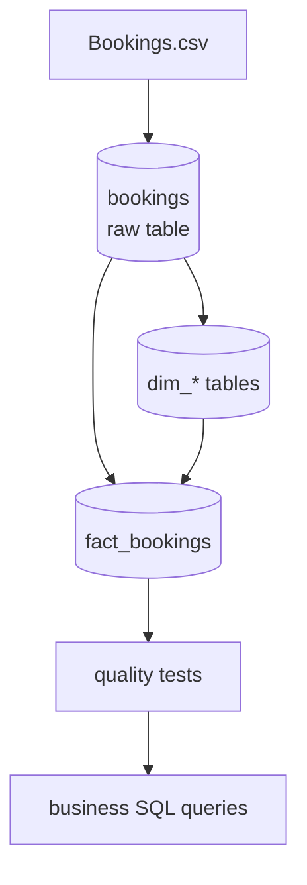

<div align="center">


# UBER: Kimball Architecture

A Postgres pipeline that loads a raw ride booking CSV and builds a Kimball style star schema for analytics. One row in `fact_bookings` equals one booking. Docker, the loader, and the quality tests all exist to get data into that model safely and keep it trustworthy.


</div>

## Data Flow



The raw table is a plain copy of the CSV. The star schema (`fact_bookings` plus the `dim_*` tables) is built from it and can be rebuilt at any time by running the model scripts again, since the raw table itself is never touched.

## Installation

Prerequisites: Git and Docker Desktop.

1. Clone the repo:
   ```bash
   git clone https://github.com/Nitinx12/Data_Modeling
   cd UBER
   ```
2. Create a `.env` file inside `docker/`, next to `compose.yml`:
   ```dotenv
   POSTGRES_USERNAME=uber_user
   POSTGRES_PASSWORD=change_me
   POSTGRES_DATABASE=uber_bookings
   TABLE_NAME=bookings
   CHUNK_SIZE=5000
   CSV_HOST_PATH=C:/UBER/data/Bookings.csv
   ```
   Use forward slashes in `CSV_HOST_PATH` even on Windows.
3. Build and run:
   ```bash
   cd docker
   docker compose up --build
   ```
   This starts Postgres, waits for it to become healthy, then runs the full pipeline in order: create schema, load the CSV, populate dimensions, populate the fact table, run quality checks.
4. On later runs, skip the rebuild:
   ```bash
   docker compose up
   ```

No Docker: see `docs/pipeline.md` for the native Windows path, which uses `ps1/pipeline.ps1` and `uv`.

## Project Structure

```
UBER
Γö£ΓöÇ assets/   logo image used in this README
Γö£ΓöÇ docker/   compose file, Dockerfile, entrypoint script
Γö£ΓöÇ docs/     full documentation, see below
Γö£ΓöÇ model/    DDL and transform scripts, the star schema itself
Γö£ΓöÇ ps1/      native Windows pipeline script, no Docker path
Γö£ΓöÇ scripts/  Python loader and quality check scripts
Γö£ΓöÇ sql/      business question queries the model exists to answer
Γö£ΓöÇ tests/    standalone SQL test suite
ΓööΓöÇ utils/    shared DB connection and logging helpers
```

## Documentation

This README stays short on purpose. Full detail lives in `docs/`.

| File | Covers |
|---|---|
| [`docs/architecture.md`](docs/architecture.md) | Why a star schema, the four step Kimball process, design tradeoffs, build order, idempotency |
| [`docs/model.md`](docs/model.md) | The full data catalog: every table, every column, and the ERD |
| [`docs/incremental.md`](docs/incremental.md) | How the CSV loader works and why it is safe to run again and again |
| [`docs/docker.md`](docs/docker.md) | What each container does, environment variables, common commands |
| [`docs/pipeline.md`](docs/pipeline.md) | What `ps1/pipeline.ps1` does, its four steps, and its configuration, for running without Docker |
| [`docs/data_quality.md`](docs/data_quality.md) | All 10 validation checks, grouped by category, with expected results |

One thing worth confirming before you run the tests: your raw table needs to actually be named `bookings`. An earlier draft of `docs/data_quality.md` wrote Test 1 and Test 5 against a table called `booking`, while the loader and model scripts all use `bookings`.
