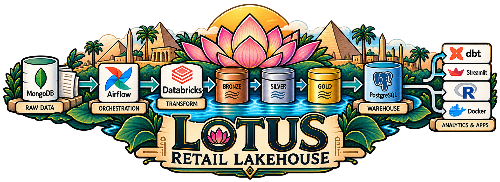
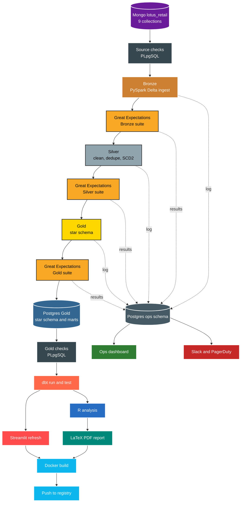
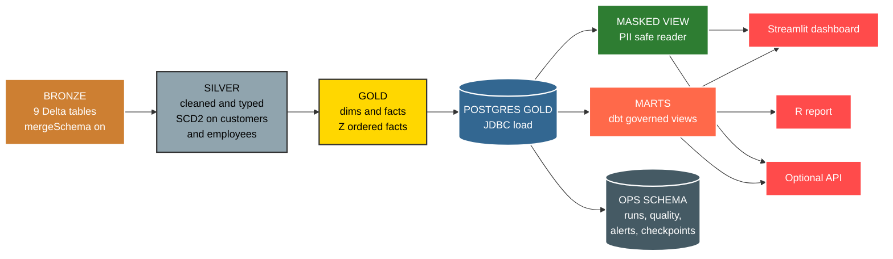

<div align="center">



# Lotus Retail Lakehouse

**A retail lakehouse that carries data from raw landing to governed marts, with full operational visibility.**

</div>

Lotus Retail Lakehouse moves the Lotus retail dataset from MongoDB through Bronze, Silver and Gold layers into a Postgres serving warehouse and dbt marts. Quality gates and ops tracking run at every stage.

For the full design read [ARCHITECTURE.md](ARCHITECTURE.md). For working rules read [AGENTS.md](AGENTS.md).

## Highlights

* **MongoDB** is the raw landing zone and stays untouched after load.
* **PySpark** transforms data on Delta tables across the medallion layers.
* **Postgres** is both the serving warehouse and the ops store.
* **Airflow** is the control plane, with retries, backfills and SLAs.
* **dbt** is the semantic layer, with tests and lineage.
* **Streamlit**, **R** and an optional API read from Gold.

## Pipeline Flow



## Data Layers and Serving



## Tech Stack

<div align="center">

Core runtimes, data, orchestration, serving and quality, pinned in `pyproject.toml`, the compose files and the CI workflows.


<table>
  <thead>
    <tr>
      <th align="center">Layer</th>
      <th align="center">Technology</th>
      <th align="center">Version and notes</th>
    </tr>
  </thead>
  <tbody>
    <tr><td align="center"><b>Language</b></td><td align="center">Python</td><td align="center">3.13 (CI on 3.11, Docker on 3.12 slim)</td></tr>
    <tr><td align="center"><b>OS</b></td><td align="center">Ubuntu</td><td align="center">24.04 (CI on ubuntu-latest, Docker on bookworm)</td></tr>
    <tr><td align="center"><b>Compute</b></td><td align="center">PySpark</td><td align="center">4.1.x with OpenJDK 17</td></tr>
    <tr><td align="center"><b>Warehouse</b></td><td align="center">PostgreSQL</td><td align="center">16, serving and ops store</td></tr>
    <tr><td align="center"><b>Source</b></td><td align="center">MongoDB</td><td align="center">Operational source with an incremental <code>$gt</code> watermark</td></tr>
    <tr><td align="center"><b>Transform</b></td><td align="center">dbt core and dbt postgres</td><td align="center">1.12 and 1.11, 17 models, 100+ tests</td></tr>
    <tr><td align="center"><b>Orchestration</b></td><td align="center">Apache Airflow</td><td align="center">3.3.x on CeleryExecutor</td></tr>
    <tr><td align="center"><b>Quality</b></td><td align="center">Great Expectations</td><td align="center">1.21, Bronze, Silver and Gold suites</td></tr>
    <tr><td align="center"><b>BI</b></td><td align="center">Streamlit and Plotly</td><td align="center">1.62 and 7.0 on the Gold star schema</td></tr>
    <tr><td align="center"><b>Packaging</b></td><td align="center">uv</td><td align="center"><code>uv.lock</code> is the source of truth</td></tr>
    <tr><td align="center"><b>Lint and format</b></td><td align="center">Ruff, SQLFluff, pre-commit</td><td align="center"><code>ruff check</code>, <code>ruff format</code>, <code>sqlfluff lint</code></td></tr>
    <tr><td align="center"><b>Containers</b></td><td align="center">Docker and Compose</td><td align="center"><code>Dockerfile</code> and <code>Dockerfile.airflow</code></td></tr>
    <tr><td align="center"><b>CI</b></td><td align="center">GitHub Actions</td><td align="center">Lint, dashboard smoke, unit, DAG, Docker and integration jobs</td></tr>
  </tbody>
</table>

</div>

## Getting Started

The steps below take you from a fresh clone to a running pipeline. Each step shows a Windows (PowerShell) command first, then the Linux or macOS equivalent where it differs.

**1. Fork and clone**

```powershell
git clone https://github.com/<your-user>/lotus-retail-lakehouse.git
cd lotus-retail-lakehouse
```

**2. Install dependencies**

```powershell
uv sync
```

**3. Create the local env file**

```powershell
Copy-Item .env.example .env
```

```bash
cp .env.example .env
```

**4. Start the infrastructure**

```powershell
powershell -File scripts/docker_up.ps1 up -d
```

```bash
bash scripts/docker_up.sh up --build
```

**5. Initialise the ops schema**

```powershell
$env:PYTHONPATH = "."
uv run python scripts/init_ops.py
```

```bash
PYTHONPATH=. uv run python scripts/init_ops.py
```

**6. Run the stages in order**

```powershell
powershell -File scripts/run_ingest.ps1
powershell -File scripts/run_silver.ps1
powershell -File scripts/run_gold.ps1
powershell -File scripts/run_publish.ps1
powershell -File scripts/run_quality_gate.ps1
powershell -File scripts/run_report.ps1
```

```bash
bash scripts/run_ingest.sh
bash scripts/run_silver.sh
bash scripts/run_gold.sh
bash scripts/run_publish.sh
bash scripts/run_quality_gate.sh
bash scripts/run_report.sh
```

**7. Build the marts and open the dashboard**

```powershell
$env:DBT_PROFILES_DIR = "./dbt"
uv run dbt run --project-dir dbt --target dev
uv run dbt test --project-dir dbt --target dev
uv run streamlit run dashboard/app.py
```

**8. Verify before every commit**

```powershell
uv run pytest tests/unit tests/smoke tests/dag tests/integration -q
uv run ruff check .
uv run ruff format --check src scripts tests dags dashboard
uv run sqlfluff lint sql/
```

> **Connection notes.** Gold writers use the pipeline role, which owns the Gold and marts schemas. The dashboard, R and the API read through the pooler with the app role, which sees the masked customer view and never the unmasked PII table. Staging and prod secrets resolve through a Vault style backend and Airflow connections, never through committed files. See [docs/SECURITY.md](docs/SECURITY.md) and [docs/ENVIRONMENTS.md](docs/ENVIRONMENTS.md) for detail.

## Project Layout

```text
src/         Pure transforms: input frame in, output frame out
scripts/     One runner per stage, with matching .ps1 and .sh twins
sql/         Ops DDL, roles, grants, masked view and PLpgSQL checks
dags/        Airflow control plane
dbt/         Governed marts
dashboard/   Retail view and ops page
r/           Analysis sources
dotnet-api/  Optional read only Gold serving API
tests/       Unit, smoke, DAG integrity and integration suites
docs/        Per area guides with flow charts
runbooks/    Restore procedure
docker/      Compose files and images
data/        Local only, gitignored seeds and backups
logs/        Per stage logs read by ops monitoring
```

## Quality Gates

Every Silver transform ships with a unit test. A failing test blocks the run, so never route around it. Use the one shot gate for a full local check:

```bash
bash scripts/run_tests.sh
```

Or run the suites individually:

```powershell
uv run pytest tests/unit -q
uv run pytest tests/smoke -q
```

See [docs/DATA_QUALITY.md](docs/DATA_QUALITY.md) and [docs/TESTING.md](docs/TESTING.md) for thresholds and suite layout.

## Documentation

Start with the design docs, then go deeper by area. Guides live under `docs/`, plus the two root guides.

| Guide | What you will find |
|:---|:---|
| [ARCHITECTURE.md](ARCHITECTURE.md) | Full system design from landing to serving, with the major decisions |
| [AGENTS.md](AGENTS.md) | Working rules for code style, tests and git hygiene |
| [docs/PIPELINE.md](docs/PIPELINE.md) | Stage order, entry points and rerun behaviour |
| [docs/DATA_DICTIONARY.md](docs/DATA_DICTIONARY.md) | Table and column meanings across Bronze, Silver, Gold and marts |
| [docs/DATA_QUALITY.md](docs/DATA_QUALITY.md) | Quality suites, thresholds and gate behaviour |
| [docs/DBT.md](docs/DBT.md) | Mart definitions, tests and lineage usage |
| [docs/SECURITY.md](docs/SECURITY.md) | Roles, masked views, secrets handling and least privilege |
| [docs/ENVIRONMENTS.md](docs/ENVIRONMENTS.md) | Dev, staging and prod separation and the promotion path |
| [docs/DEPLOYMENT.md](docs/DEPLOYMENT.md) | Docker images, compose stack and publish flow |
| [docs/MONITORING.md](docs/MONITORING.md) | Ops tables, SLAs, alerts and dashboard usage |
| [docs/API.md](docs/API.md) | Optional reader API surface and auth model |
| [docs/TESTING.md](docs/TESTING.md) | Unit, smoke, DAG and integration suites, plus the gate script |
