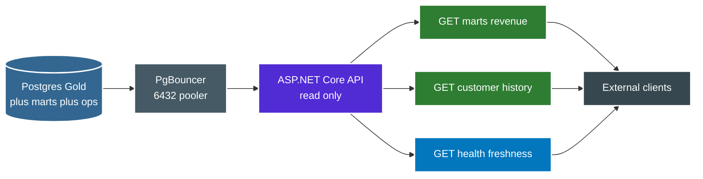

# API

Optional read only ASP.NET Core API over Postgres Gold. Same data as Streamlit and R. No role in orchestration or transforms.



Endpoints served today with next step for history and freshness.

```text
GET api/marts/revenue-by-store-month : optional storeId plus month filters, reads governed mart
GET api/health/live                  : liveness probe for container healthcheck, no db touch
NEXT api/customers/id/history        : versioned rows as of order date from SCD2 dims
NEXT api/health/freshness            : read only view on ops.pipeline_runs plus quality for Gold age
```

Data access and config pattern.

```text
access : EF Core scaffolded from gold schema or Dapper, SELECT only on gold plus masked view
role   : scoped reader that sees gold.dim_customers_masked, never unmasked PII table
pooler : all reads go through PgBouncer, never direct to Postgres during batch write
config : local reads appsettings Development plus .env, staging prod pull DSN from secrets backend
env    : ASPNETCORE_ENVIRONMENT mirrors LOTUS_ENV to pick connection plus schema
image  : Dockerfile.api with own tag plus dotnet build plus dotnet test in CI
```

Points to remember.

* 1. API sits downstream of Gold publish. No task upstream knows it exists.
* 2. Use masked view for any customer read. Unmasked table stays admin only.
* 3. Freshness endpoint reads ops, never writes ops.
* 4. Keep API stateless so any replica can serve behind same pooler.
* 5. Version the API when mart shape changes, keep old path until clients move.
