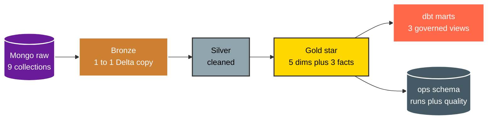

# Data Dictionary

Source is Lotus Retail Dataset in Mongo. Fictional Egypt retail. 9 collections. 42877 rows. January 2022 to December 2024. Star shaped with built in quality faults.



Source grain and natural keys.

```text
dim_customers       : one row per customer, key customer_id, has PII plus dupes plus case faults
dim_employees       : one row per employee, key employee_id
dim_products        : one row per product, key product_id, names need split on pipe
dim_stores          : one row per store, key store_id
dim_date            : one row per calendar date, key date_id, has is_ramadan flag
fact_orders_2022_2023 : one row per order header 2022 to 2023, key order_id
fact_orders_2024      : one row per order header 2024, key order_id, append with prior set
fact_order_details    : one row per order line, key detail_id, parent order_id
fact_returns          : one row per return, key return_id, parent order_id, needs enrich from details
```

Silver output after cleaning.

```text
silver.dim_customers  : deduped, trimmed, gender set to Male Female, phone as text, dates parsed
silver.dim_products   : product_name_raw split into product_name plus color plus size
silver.dim_stores     : trimmed passthrough
silver.dim_employees  : trimmed passthrough plus versioned for SCD2
silver.dim_date       : static calendar passthrough
silver.fact_orders    : union of both orders sets, trimmed, dates parsed, deduped on order_id
silver.fact_returns   : left join to details for n_items plus order_revenue plus orphan flag
```

Gold star joins as of order date for versioned dims.

```text
dim_date, dim_stores, dim_products : Type 1, current values only
dim_customers : Type 2 on region plus loyalty_tier, cols customer_sk plus effective_start_date plus effective_end_date plus is_current plus attribute_hash
dim_employees : Type 2 on store_id plus role, cols employee_sk plus effective_start_date plus effective_end_date plus is_current plus attribute_hash
fact_orders   : order grain with customer_sk plus employee_sk plus store_id plus totals
fact_returns  : return grain with customer_sk plus store_id carried from orders
fact_order_details : line grain carried through for return rate logic
```

Governed marts built by dbt on top of Gold.

```text
revenue_by_store_month : store_id plus month plus revenue plus cost plus orders
return_rate_by_product : product_id plus times_ordered plus times_returned plus return_rate
ramadan_seasonality    : month plus is_ramadan plus revenue plus orders
```

Ops store in Postgres.

```text
ops.pipeline_runs       : run_id plus task_name plus status plus started_at plus ended_at plus rows_in plus rows_out
ops.quality_results     : run_id plus suite_name plus success_percent plus failed_expectations
ops.extract_checkpoints : source_collection plus last_object_id plus rows_copied
ops.schema_changes      : table_name plus column_name plus change_type plus detected_at
ops.alerts              : source_task plus severity plus message plus detected_at
```

Key facts to remember.

* 1. Bronze mirrors Mongo shape exactly. No cleaning in Bronze.
* 2. Silver fixes all listed faults with pure functions in `src/silver`.
* 3. Only customers and employees are versioned. Products, stores and date stay Type 1.
* 4. Facts always join versioned dims as of order date. Never join on natural key alone.
* 5. PII lives only in `gold.dim_customers`. General readers use `gold.dim_customers_masked`.
