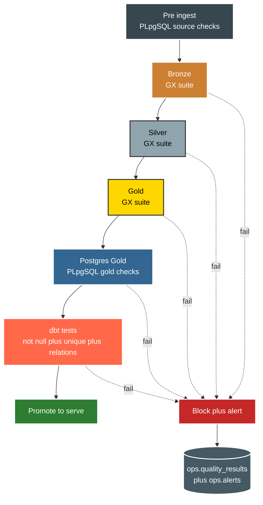

# Data Quality

Quality gates sit before and after every layer change. Failure blocks promotion. Never route around a red gate.



What each gate checks.

```text
source_checks.sql : stuck running rows in ops.pipeline_runs, blocks ingest on dirty state
GX bronze : row count above zero plus key column exists for all 9 tables
GX silver : unique customer_id, gender in Male Female, product_name present,
            unique order_id, payment_method in Cash Credit Card Debit Card Fawry InstaPay Vodafone Cash
GX gold   : customer_sk present on facts, unique order_id on fact_orders
gold_checks.sql : no future order_date, no negative return_amount,
                  no orphan returns, no null customer_sk
dbt tests : not null plus unique plus foreign key relations on the 3 marts
```

Run gates locally with these entry points.

```bash
uv run python scripts/run_quality.py
uv run python scripts/run_gx.py --suite bronze
uv run python scripts/run_gx.py --suite silver
uv run python scripts/run_gx.py --suite gold
uv run python scripts/run_plpgsql.py
```

Points to remember.

* 1. Every Silver transform ships with a unit test. Done means code plus test plus green gate.
* 2. Great Expectations results land in `ops.quality_results` with pass percent and fail count.
* 3. PLpgSQL loops catch what GX and dbt miss, such as future dates and negative amounts.
* 4. Never skip or comment out a failing test to force green. Fix it or flag it in the PR.
* 5. Schema drift in Bronze uses mergeSchema true and logs to `ops.schema_changes`.
