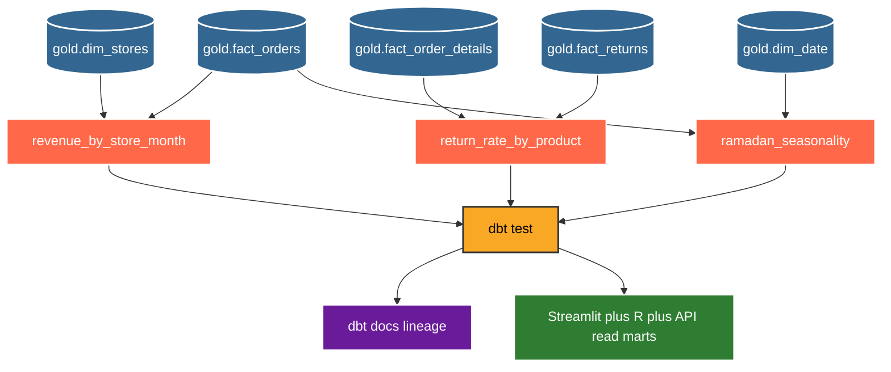

# dbt

dbt owns the governed metric layer on top of Postgres Gold. Spark builds staging marts. dbt builds served truth. If two dashboards disagree, dbt wins.



Models in this repo.

```text
models/marts/revenue_by_store_month.sql : store month revenue cost orders
models/marts/return_rate_by_product.sql : product times ordered times returned return rate
models/marts/ramadan_seasonality.sql    : month is_ramadan revenue orders
models/sources.yml : declares gold dims plus facts as sources
models/schema.yml  : not null plus unique plus relations tests
```

Run and test locally.

```bash
uv run dbt run --project-dir dbt --target dev
uv run dbt test --project-dir dbt --target dev
uv run dbt docs generate --project-dir dbt
```

Points to remember.

* 1. Mart names in dbt are bare names. Spark files use mart prefix and stay unpublished.
* 2. Casts use `::VARCHAR` style to satisfy SQLFluff.
* 3. dbt runs after JDBC publish and after PLpgSQL gold checks in the DAG.
* 4. dbt test failure blocks the run the same way a GX failure does.
* 5. Use `dbt docs serve` output as living lineage from source to mart.
