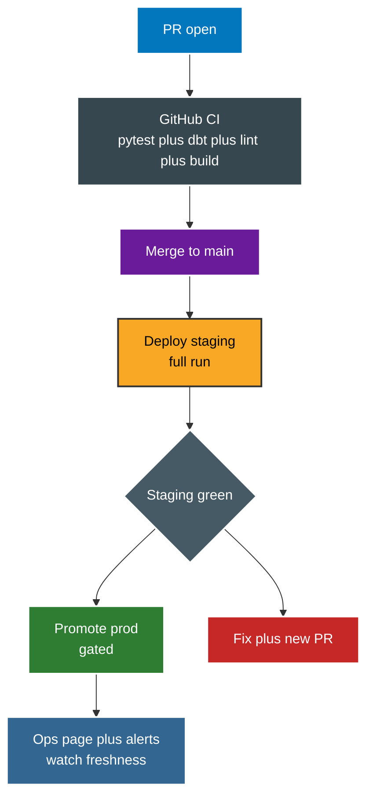

# Deployment

Pipeline ships as images. Compose runs local stack. CI builds on PR. Main promotes through staging to prod.



Local stack from compose.

```text
postgres  : Gold plus ops, seeded roles plus ops schema on first start
mongo     : raw landing, seeded from data/raw by mongo-seed
pgbouncer : pooler for app traffic on 6432
pipeline  : one shot run of main.py all with pipeline role
dashboard : Streamlit on 8501 with app role through pooler
report    : R plus LaTeX build to reports/
airflow   : standalone on 8081 with DAG plus scripts mounted
```

Images built from docker folder.

```text
Dockerfile.pipeline  : python plus deps plus src plus scripts
Dockerfile.dashboard : Streamlit app plus pooled engine
Dockerfile.report    : R plus pandoc plus latexmk
Dockerfile.airflow   : scheduler plus DAG plus providers
Dockerfile.api       : ASP.NET Core read only API
```

Bring up and run locally.

```bash
powershell -File scripts/docker_up.ps1 up -d
powershell -File scripts/run_ingest.ps1
powershell -File scripts/run_silver.ps1
powershell -File scripts/run_gold.ps1
powershell -File scripts/run_publish.ps1
powershell -File scripts/run_quality_gate.ps1
powershell -File scripts/run_report.ps1
```

Points to remember.

* 1. Use one branch per task with names like `feature/short name`. Never commit straight to main.
* 2. Rebase onto main before PR. Keep history linear. Squash merge then delete branch.
* 3. Update CHANGELOG only when behavior changes, not on every commit.
* 4. Prod promote is gated on green staging run plus green dbt test.
* 5. Restore path lives in `runbooks/restore.md` for corrupt Gold or lost ops.
