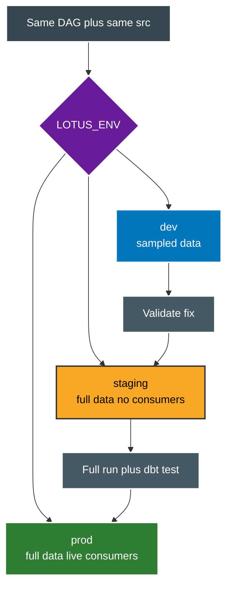

# Environments

One codebase. Three targets. Airflow Variable selects target. Code never branches on hardcoded names.



What changes per target.

```text
catalog : dev_lotus versus staging_lotus versus prod_lotus
gold db : lotus_gold_dev versus lotus_gold_staging versus lotus_gold_prod
ops db  : matching ops db per target, same 5 tables
conns   : postgres_ops_dev versus staging versus prod, same for gold plus databricks
api env : ASPNETCORE_ENVIRONMENT mirrors LOTUS_ENV for connection choice
```

Local bootstrap uses `.env` only for sandbox values.

```bash
Copy-Item .env.example .env
uv sync
powershell -File scripts/docker_up.ps1 up -d
uv run python scripts/init_ops.py
```

Points to remember.

* 1. Validate Silver change in dev on small data first.
* 2. Promote to staging for full data run with no downstream readers pointed at it.
* 3. Promote to prod only after staging run plus dbt test are green.
* 4. Staging and prod secrets come from Vault or cloud manager, never from `.env`.
* 5. Backfill by date range in Airflow, never by manual rerun of full pipeline.
