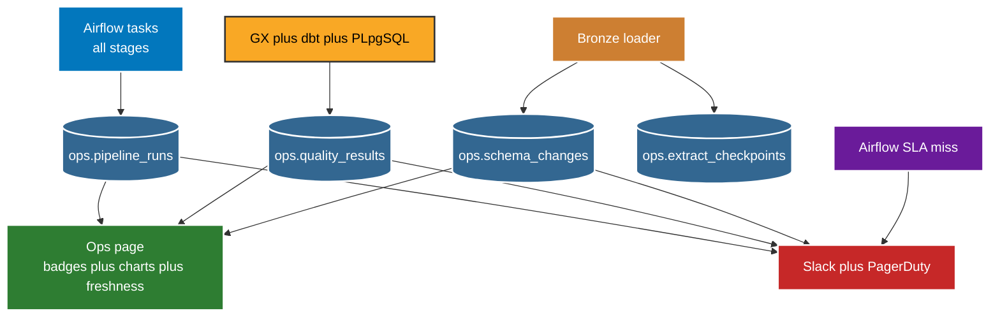

# Monitoring

Every task writes run state to Postgres ops. Streamlit reads ops for history. Airflow callbacks push alerts for action.



Ops page lives at `dashboard/pages/5_Ops.py` and shows only ops data.

```text
task status badges from ops.pipeline_runs
duration chart per task to spot slow stages
row count trend to spot silent drops
quality pass rate over time from ops.quality_results
schema change feed from ops.schema_changes
freshness banner red when Gold is older than SLA
```

Concrete SLAs measured on the page.

```text
Gold refreshed by 7 AM IST on scheduled run days
95 percent of DAG runs finish inside 30 minutes
No task retries more than twice before run marks failed
Quality suites stay above threshold or alert fires
Schema change insert always fires notice
```

Points to remember.

* 1. Page is for browsing history. Alerts are for waking up. Both read same ops rows.
* 2. Each task writes running on start and terminal state on finish with row counts.
* 3. All GX plus dbt results store pass percent plus failed count with timestamp.
* 4. Extract checkpoints store resume point so retry continues, not restarts.
* 5. Logs also land under `logs/` per stage for ops monitoring to tail.
