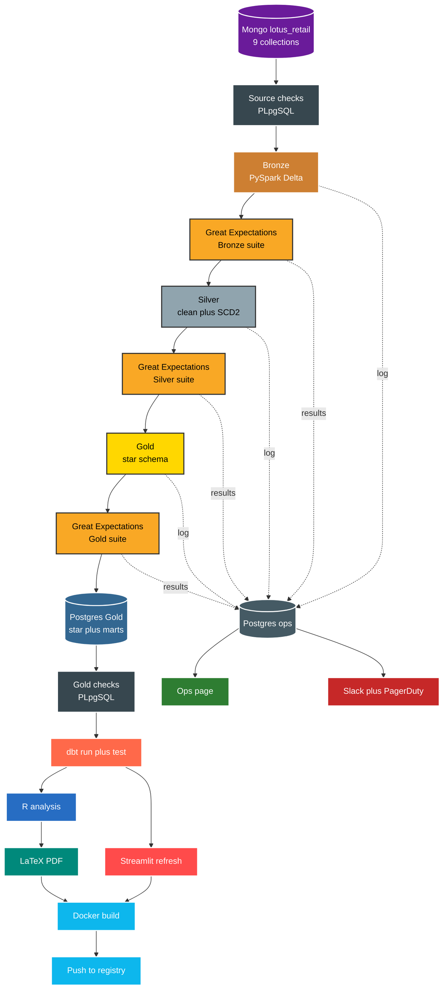

# Pipeline

Lotus Retail Lakehouse moves retail data from Mongo landing to governed marts in Postgres. Airflow owns order, retries and SLAs. Databricks owns compute. Postgres owns serving and ops history.



Stages in run order with local entry points.

```text
1 source checks : sql/plpgsql_checks/source_checks.sql
2 bronze ingest : scripts/run_ingest.py plus scripts/run_bronze.py
3 silver clean  : scripts/run_silver.py plus scripts/run_scd2.py
4 gold build    : scripts/run_gold.py
5 publish       : scripts/run_publish.py writes Gold to Postgres over JDBC
6 gold checks   : sql/plpgsql_checks/gold_checks.sql
7 quality gate  : scripts/run_quality_gate.py plus scripts/run_gx.py
8 semantic      : dbt run plus dbt test in dbt/
9 report        : scripts/run_report.py renders R plus LaTeX to reports/
```

Core rules to keep in mind.

* 1. Every write is idempotent. Bronze, Silver and Gold use MERGE on business keys. Rerun gives same result.
* 2. Every Airflow task retries twice with backoff. Failure lands in `ops.pipeline_runs` and fires alert.
* 3. One script per stage. Each stage logs to its own file under `logs/`.
* 4. Never write back into Mongo. Mongo stays untouched after load.
* 5. Gold refresh is the only path to Postgres, Streamlit, R and API. No side writes.
