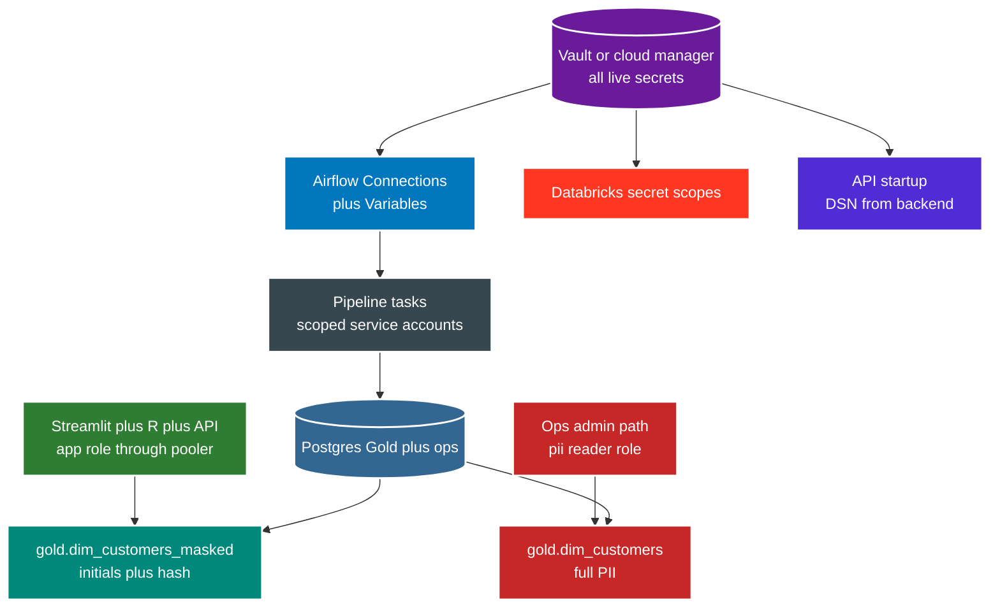

# Security

No live credential in files. Local `.env` is sandbox only. Staging and prod resolve from secrets backend at run time.



Roles and access in Postgres.

```text
lotus_pipeline  : writer, owns Gold plus marts plus ops writes
lotus_app       : reader through pooler, sees masked view, no unmasked PII
lotus_bi        : general BI grant base, assumed by app role
lotus_pii_reader: narrow admin role, sole reader of unmasked dim_customers
```

Masked view exposes safe columns only.

```sql
-- exposes masked customer pii to general bi roles
CREATE OR REPLACE VIEW gold.dim_customers_masked AS
SELECT
    customer_id::VARCHAR AS customer_id,
    regexp_replace(full_name::VARCHAR, '([A-Za-z])[A-Za-z]*', '\1', 'g') AS name_initials,
    encode(sha256(email::VARCHAR::bytea), 'hex') AS email_hash,
    city::VARCHAR AS city,
    region::VARCHAR AS region,
    loyalty_tier::VARCHAR AS loyalty_tier
FROM gold.dim_customers;
```

Points to remember.

* 1. Read secrets from `.env` via source locally. Never hardcode a credential or connection string.
* 2. Least privilege always. Bronze writer cannot touch Gold. App reader cannot write.
* 3. PII masking uses GRANT plus REVOKE in Postgres, not convention.
* 4. JDBC plus Mongo traffic uses TLS. Data at rest uses provider encryption.
* 5. Tokens never go into `.env` or DAG files. Refresh Databricks auth via login flow.
