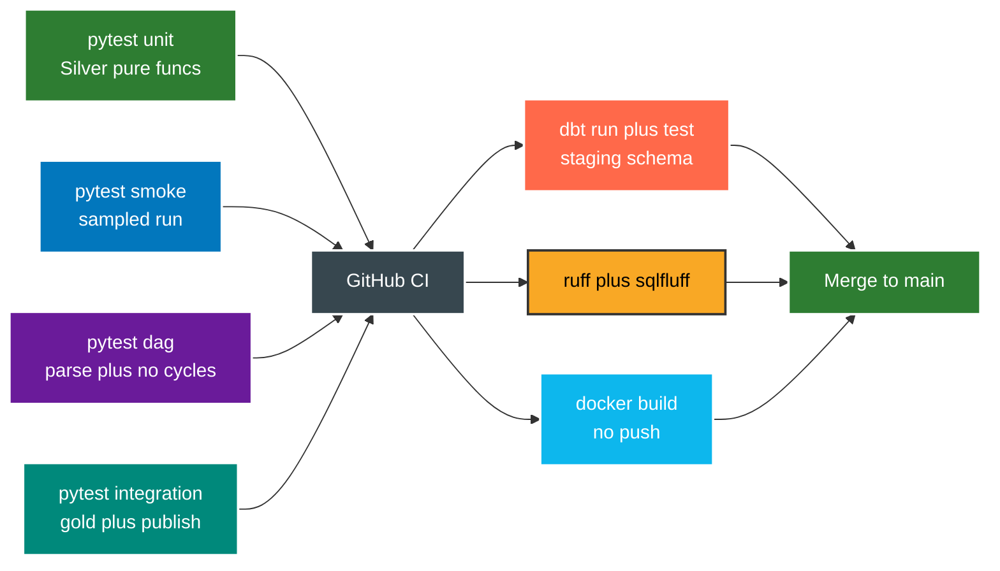

# Testing

Tests run before every commit, not just before a PR. Green means unit plus smoke plus DAG plus lint all pass.



Suites and where they live.

```text
tests/unit        : dedupe trim gender split union enrich plus SCD2 plus gold builders
tests/smoke       : fast run on sampled data in dev
tests/dag         : DAG imports clean, no cycles, retries set, SLA set, graph complete
tests/integration : gold build plus publish plus PLpgSQL checks on clean versus bad seed
tests/fixtures    : seed_gold_clean.sql plus seed_gold_bad.sql
```

Run everything locally before commit.

```bash
uv run pytest tests/unit tests/smoke tests/dag tests/integration -q
uv run ruff check .
uv run ruff format --check src scripts tests dags dashboard
uv run sqlfluff lint sql/
```

Points to remember.

* 1. Every new Silver transform ships with a unit test before it counts as done.
* 2. Never comment out or skip a failing test to get green. Fix it or note it in the PR.
* 3. DAG tests catch parse errors and missing retries before Airflow sees them in prod.
* 4. dbt test runs in CI against a staging like schema, not dev, not prod.
* 5. Hooks in `.githooks` run lint plus tests on commit and push when wired.
