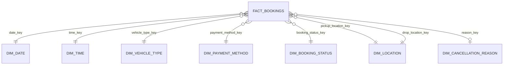
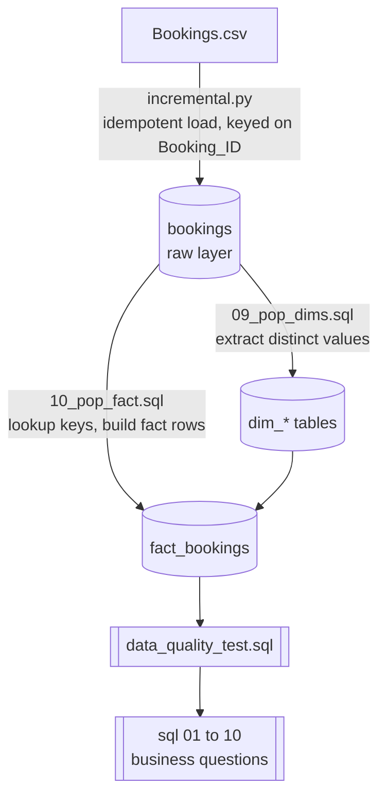
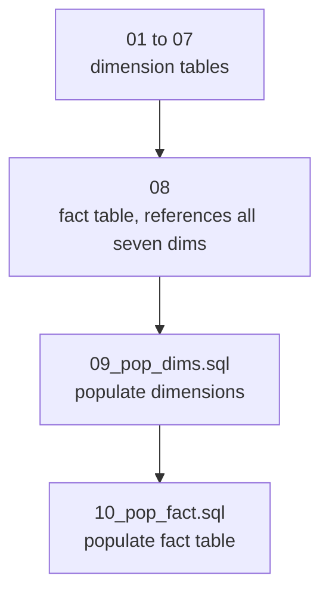

# Architecture: Data Modeling

This document explains how the data model was designed: the methodology behind it, the choices made at each step, and the tradeoffs those choices carry. See `model.md` for what the tables actually contain.

## 1. Why dimensional modeling

This project uses Kimball style dimensional modeling (a star schema) instead of a fully normalized (3NF) schema.

| | 3NF (normalized) | Star schema (this project) |
|---|---|---|
| Optimized for | Transactional writes, no redundancy | Analytical reads, fast aggregation |
| Joins for a typical report | Many, often nested | One hop from fact to each dimension |
| Query pattern here | N/A, this is not a transactional system | Total revenue by vehicle type, by day, by payment method, exactly what a star schema is built for |

This project exists to answer business questions (`sql/01` to `10`), not to process live bookings, so a star schema trades some storage and redundancy for simpler, faster analytical queries.

## 2. The four step process

Kimball's methodology defines a model in four steps, always in this order.


**Step 1, business process:** Bookings. Not customers, not drivers. The atomic event being modeled is a single ride booking.

**Step 2, grain:** One row in `fact_bookings` equals one booking, identified by `booking_id`. This is the single most important decision in the model; every dimension and measure must be true at this grain. It is also why `booking_id` is a `PRIMARY KEY`, the grain is enforced structurally, not just by convention.

**Step 3, dimensions:** everything you would want to slice a booking by.

| Dimension | Answers |
|---|---|
| `dim_date` | When (calendar attributes) |
| `dim_time` | What time of day |
| `dim_vehicle_type` | What kind of vehicle |
| `dim_payment_method` | How it was paid for |
| `dim_booking_status` | What happened to it |
| `dim_location` (used twice) | Where from, where to |
| `dim_cancellation_reason` | Why it failed, when applicable |

**Step 4, facts:** the numeric values on `fact_bookings`: `booking_value`, `ride_distance`, `customer_rating`, `driver_ratings`, `v_tat`, `c_tat`, plus three boolean outcome flags.

The order matters. Dimensions and facts are only defined after the grain is locked in. If the grain were "one row per booking per status change event" instead, almost everything below would change.

## 3. The star schema



`dim_location` appears twice because `pickup_location_key` and `drop_location_key` both point to the same table. `reason_key` is the only optional link, since it only applies to canceled bookings.

## 4. Key design decisions

**Surrogate keys vs smart keys.** Most dimensions use a Postgres `SERIAL` surrogate key, an arbitrary integer with no relation to the business value. This is the standard recommendation: surrogate keys stay stable even if the business value changes, and they are cheap to join on.

`dim_date` and `dim_time` break this pattern on purpose and use a smart key instead:

```sql
date_key INT PRIMARY KEY   -- e.g. 20240115 (yyyymmdd)
time_key INT PRIMARY KEY   -- e.g. 1430 for 14:30
```

This is a common, intentional exception for date and time dimensions, because the key can be computed directly from the source (`TO_CHAR("Date", 'YYYYMMDD')::INT`) without a lookup join, and it is easy to read in ad hoc queries (`WHERE date_key BETWEEN 20240101 AND 20240131`). The tradeoff: if the date or time format ever changes, that format is baked into every fact row, where a surrogate key would have been insulated from it.

**Degenerate dimensions.** `booking_id` and `customer_id` live directly on `fact_bookings`, not in their own tables. A degenerate dimension is an identifier with no attributes worth modeling beyond the ID itself. `booking_id` cannot be pulled into its own table anyway, it is the grain of the fact table. `customer_id` is treated the same way because no customer attributes (name, signup date, tier) exist in the source data yet. If they did, a proper `dim_customer` would be worth splitting out.

**Role playing dimension: `dim_location`.** Rather than two separate tables for pickup and drop, there is a single `dim_location` referenced twice. This is correct because a place like Connaught Place is the same real world entity whether it is a pickup or a drop point. Splitting it in two would duplicate every location and make "which locations serve as both pickup and drop" impossible to answer simply. The cost: any query using both roles has to alias `dim_location` twice and join it twice.

**Flags instead of a junk dimension.** `canceled_by_customer_flag`, `canceled_by_driver_flag`, and `incomplete_rides_flag` are plain booleans on the fact table, derived at load time from whether the source columns are not null. An alternative would bundle these three low cardinality flags into a junk dimension, a table that exists purely to hold combinations of unrelated flags. That was not done here, most likely because three booleans do not meaningfully widen the fact table, and filtering directly (`WHERE incomplete_rides_flag`) is simpler than joining out first. Worth revisiting if more categorical flags get added later.

**No slowly changing dimension handling.** Every dimension is populated with an insert if not already present pattern:

```sql
INSERT INTO dim_vehicle_type (vehicle_type)
SELECT DISTINCT "Vehicle_Type" FROM booking WHERE "Vehicle_Type" IS NOT NULL
ON CONFLICT (vehicle_type) DO NOTHING;
```

Every dimension insert needs its own `ON CONFLICT (...) DO NOTHING`, since a plain insert into a unique, not null column errors on a duplicate rather than skipping it quietly. This is effectively SCD Type 0 (values never change once inserted), or generously Type 1 (no history kept at all). There is no `valid_from` or `valid_to`, no versioning. Fine for this dataset, since vehicle types, payment methods, and location names are not expected to change meaning over time, but worth naming: if a dimension's meaning ever needs to change while preserving history, this design overwrites forward instead of preserving the old association.

**Additivity of measures.** Not every column on `fact_bookings` aggregates the same way.

| Measure | Behavior | Why |
|---|---|---|
| `booking_value` | Fully additive | Summing fares across any dimension combination is meaningful |
| `ride_distance` | Fully additive | Summing distance across trips is meaningful |
| `v_tat`, `c_tat` | Partly additive | Averaging is meaningful, summing turnaround time across bookings is not |
| `customer_rating`, `driver_ratings` | Not additive | Only averages or distributions make sense |

This is why every query in `sql/` uses `AVG()` for ratings and TAT, but `SUM()` for `booking_value` and `ride_distance`. That is not a style choice, it is what the measures allow.

## 5. Raw layer vs modeled layer



The raw layer is a faithful, denormalized copy of the CSV, easy to reload and easy to debug against. The modeled layer is what analytics actually queries. Keeping them separate means a modeling mistake never corrupts the raw data, and the star schema can be rebuilt at any time by running `09_pop_dims.sql` then `10_pop_fact.sql` again against the untouched raw table.

## 6. Build order is not arbitrary

The `model/` folder's numeric prefixes encode a real dependency order, driven by the foreign keys on `fact_bookings`.



Dimensions must exist before the fact table, since `fact_bookings` references all seven of them; Postgres refuses to create the fact table first. Dimensions must be populated before the fact table is populated, because `10_pop_fact.sql` does a `LEFT JOIN` against each dimension to translate raw text (`"Vehicle_Type"`) into a surrogate key. If a dimension were empty, every one of those lookups would return `NULL`, exactly what `data_quality_test.sql` Test 3 (unexpected nulls) and Test 5 (dimension completeness) are built to catch.

## 7. Idempotency across the pipeline

The raw layer was idempotent from the start, `incremental.py` upserts with `ON CONFLICT (Booking_ID) DO NOTHING`. The modeled layer now matches that guarantee.

* `09_pop_dims.sql`: every insert uses `ON CONFLICT (...) DO NOTHING` against its unique business column, so running it again after new bookings arrive only adds genuinely new dimension values instead of erroring on a duplicate.
* `10_pop_fact.sql`: adds a `WHERE NOT EXISTS (SELECT 1 FROM fact_bookings fb WHERE fb.booking_id = b."Booking_ID")` filter, so it only processes bookings not already in the fact table, plus `ON CONFLICT (booking_id) DO NOTHING` as a safety net against a race between two concurrent loads.

With all three layers idempotent, the full chain, `incremental.py` then `09_pop_dims.sql` then `10_pop_fact.sql`, can run repeatedly or on a schedule with no manual cleanup between runs. That is what makes it safe to hand to an orchestrator such as cron, Airflow, or Dagster.

## 8. Referential integrity strategy

All eight foreign keys on `fact_bookings` use `ON UPDATE NO ACTION / ON DELETE NO ACTION`, the Postgres default when unspecified. In practice, Postgres will block deleting or renaming a dimension row (say, a `location_name`) if any fact row still references it. Combined with the insert only dimension pattern in section 4, this makes the model safe against accidental data loss, at the cost of needing a deliberate cleanup step if a dimension value genuinely needs to be retired.

## 9. Summary: what each layer is for

| Layer | Files | Role |
|---|---|---|
| Ingestion | `scripts/incremental.py`, `utils/logger.py` | Get the CSV into Postgres, idempotently, with an audit trail |
| Schema (DDL) | `model/01` to `08` | Define the star schema's structure and constraints |
| Transform | `model/09_pop_dims.sql`, `model/10_pop_fact.sql` | Populate the model from the raw layer, currently a full rebuild, see section 7 |
| Validation | `tests/data_quality_test.sql` | Confirm the model is trustworthy before anyone queries it |
| Consumption | `sql/01` to `10` | The actual business questions the model exists to answer |
| Documentation | `docs/*.md` | This file, plus `model.md` (structure), `incremental.md` (loader), `data_quality.md` (tests) |