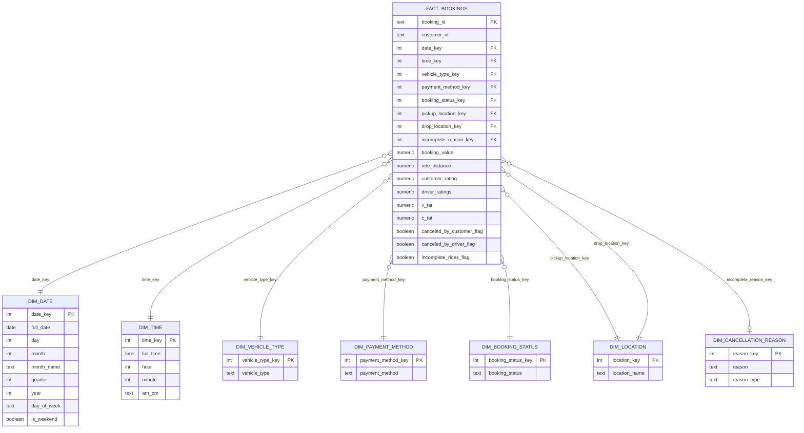

# Data Catalog: Ride Booking Data Warehouse

## 1. Architecture: Kimball Star Schema

This warehouse follows the **Kimball dimensional modeling** pattern:

- **One fact table** (`fact_bookings`) sits at the center, holding measurable events (a booking) plus foreign keys pointing out to every dimension.
- **Dimension tables** (`dim_*`) hold descriptive, mostly static attributes (dates, times, locations, statuses). Each has a cheap **surrogate key** (`SERIAL` or a derived integer like `date_key`) as its primary key. The warehouse never joins on the raw text value.
- **Degenerate dimensions** (`booking_id`, `customer_id`) live directly on the fact table because they don't need their own lookup table.
- The result is a **star**: `fact_bookings` in the middle, one join "hop" to reach any dimension. This keeps analytical queries (BI tools, Power BI, manual SQL) fast and simple, with no deep join chains.
- **Grain of the fact table:** one row = one booking (`booking_id`).

## 2. Entity Relationship Diagram

## 3. Fact Table

### `fact_bookings`
Grain: **one row per booking**.

| Column | Type | Key | Description |
|---|---|---|---|
| `booking_id` | TEXT | PK (degenerate) | Source system's unique booking identifier |
| `customer_id` | TEXT | degenerate | Source system's customer identifier, kept flat (no dim_customer) |
| `date_key` | INT | FK → dim_date | Date the booking was made |
| `time_key` | INT | FK → dim_time | Time of the booking |
| `vehicle_type_key` | INT | FK → dim_vehicle_type | Vehicle category used for the ride |
| `payment_method_key` | INT | FK → dim_payment_method | How the ride was paid for |
| `booking_status_key` | INT | FK → dim_booking_status | Final status of the booking (completed, canceled, etc.) |
| `pickup_location_key` | INT | FK → dim_location | Pickup point (reuses dim_location) |
| `drop_location_key` | INT | FK → dim_location | Drop off point (reuses dim_location) |
| `incomplete_reason_key` | INT | FK → dim_cancellation_reason | Reason a ride was canceled or left incomplete |
| `booking_value` | NUMERIC(10,2) | measure | Fare / value of the booking |
| `ride_distance` | NUMERIC(10,2) | measure | Distance traveled |
| `customer_rating` | NUMERIC(3,2) | measure | Rating given by the customer |
| `driver_ratings` | NUMERIC(3,2) | measure | Rating given to the driver |
| `v_tat` | NUMERIC(10,2) | measure | Vehicle turnaround time |
| `c_tat` | NUMERIC(10,2) | measure | Customer turnaround time |
| `canceled_by_customer_flag` | BOOLEAN | measure | True if customer canceled |
| `canceled_by_driver_flag` | BOOLEAN | measure | True if driver canceled |
| `incomplete_rides_flag` | BOOLEAN | measure | True if the ride was never completed |

## 4. Dimension Tables

### `dim_date`
| Column | Type | Description |
|---|---|---|
| `date_key` | INT (PK) | Surrogate key, format `YYYYMMDD` |
| `full_date` | DATE | Actual calendar date |
| `day` / `month` / `year` | INT | Calendar parts |
| `month_name` | TEXT | e.g. "January" |
| `quarter` | INT | 1–4 |
| `day_of_week` | TEXT | e.g. "Monday" |
| `is_weekend` | BOOLEAN | True for Sat/Sun |

### `dim_time`
| Column | Type | Description |
|---|---|---|
| `time_key` | INT (PK) | Surrogate key, e.g. `1430` for 14:30 |
| `full_time` | TIME | Actual time value |
| `hour` / `minute` | INT | Time parts |
| `am_pm` | TEXT | "AM" / "PM" |

### `dim_vehicle_type`
| Column | Type | Description |
|---|---|---|
| `vehicle_type_key` | SERIAL (PK) | Surrogate key |
| `vehicle_type` | TEXT (UNIQUE) | e.g. "Auto", "Bike", "Sedan" |

### `dim_payment_method`
| Column | Type | Description |
|---|---|---|
| `payment_method_key` | SERIAL (PK) | Surrogate key |
| `payment_method` | TEXT (UNIQUE) | e.g. "UPI", "Cash"; includes placeholder `'N/A - Trip Not Completed'` for rides with no payment recorded |

### `dim_booking_status`
| Column | Type | Description |
|---|---|---|
| `booking_status_key` | SERIAL (PK) | Surrogate key |
| `booking_status` | TEXT (UNIQUE) | e.g. "Completed", "Canceled by Driver" |

### `dim_location`
| Column | Type | Description |
|---|---|---|
| `location_key` | SERIAL (PK) | Surrogate key |
| `location_name` | TEXT (UNIQUE) | A place name; this single table is reused twice in the fact table (pickup and drop) |

### `dim_cancellation_reason`
| Column | Type | Description |
|---|---|---|
| `reason_key` | SERIAL (PK) | Surrogate key |
| `reason` | TEXT (UNIQUE) | Free text reason for cancellation or an incomplete ride |
| `reason_type` | TEXT | Bucket: `'Customer Cancel'` / `'Driver Cancel'` / `'Incomplete'` |

## 5. Load Notes

- **Idempotent dimension loads:** every `dim_*` insert in `09_pop_dims.sql` uses `ON CONFLICT (...) DO NOTHING` on the business key, so running the script again only adds genuinely new values.
- **Idempotent fact load:** `10_pop_fact.sql` filters with `WHERE NOT EXISTS` against `fact_bookings.booking_id`, backed by `ON CONFLICT (booking_id) DO NOTHING` as a safety net.
- **Source `Date` column is TEXT**, so every date function casts it to `::DATE` first before extracting parts.
- **Known gap:** `dim_time` is created and keyed, but `10_pop_fact.sql` never populates `fact_bookings.time_key`. Worth adding if analysis by time of day is needed later.