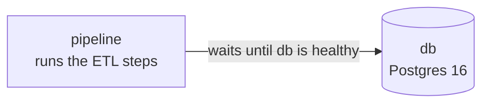
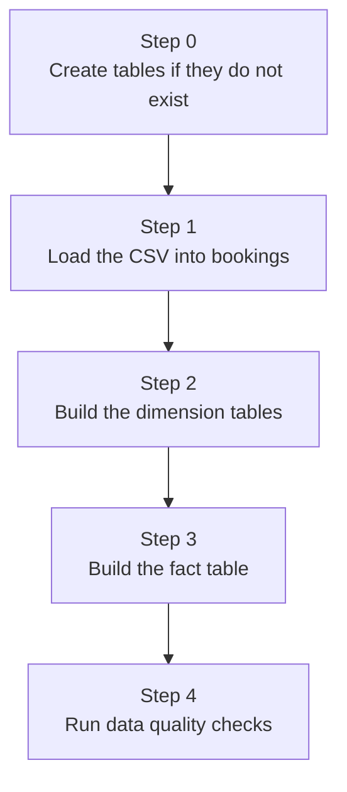

# Docker in This Project

This explains what Docker does in the pipeline, in plain terms.

## 1. Why Docker

The pipeline needs three things to line up every time it runs: the right Python version, a Postgres database, and the ETL steps running in the correct order. Without Docker, all three depend on whatever happens to already be on your machine, which is a common source of bugs that only show up on one person's computer.

`docker compose up` gives everyone, you, a teammate, or a CI system, the same Postgres version, the same Python packages, and the same run order. The only thing you need installed is Docker itself.

## 2. The two containers



`db` runs Postgres and stores the tables. `pipeline` runs the ETL code: load the CSV, build the dimensions and fact table, run the quality checks. They talk to each other over a network Docker creates automatically, using the name `db` instead of an IP address or `localhost`. `pipeline` will not even start until `db` passes its health check, so it never tries to connect before Postgres is ready.

## 3. What each file does

* **`docker/Dockerfile`**: builds the `pipeline` image. Starts from Python 3.13, installs the system tools needed to talk to Postgres, installs the project's dependencies with `uv`, then copies in the project code and sets `Entrypoint.sh` as the command that runs on start.
* **`.dockerignore`** (lives at the project root): keeps things out of the image that should not be there, like `.env`, `.venv`, logs, and `.git`. This is why secrets never end up baked into the image, they get passed in at start instead.
* **`docker/compose.yml`**: the file you actually run. It defines both containers, connects them, and sets every environment variable the pipeline needs.
* **`docker/Entrypoint.sh`**: the script that runs each time the `pipeline` container starts. See the steps below.

## 4. What Entrypoint.sh does



It stops immediately if any step fails, so a broken load never quietly continues into the next step. Every step's output is shown on screen and also saved to a timestamped file in `logs/`.

## 5. Environment variables

The project's code expects Postgres connection details under three different naming styles, because different libraries expect different names. `compose.yml` sets all three to the same values, so nothing has to be typed twice.

| Style | Used by |
|---|---|
| `PGHOST`, `PGPORT`, `PGDATABASE`, `PGUSER`, `PGPASSWORD` | `psql` |
| `POSTGRES_HOST`, `POSTGRES_PORT`, `POSTGRES_DATABASE`, `POSTGRES_USERNAME`, `POSTGRES_PASSWORD` | the Python scripts, via SQLAlchemy |
| `PGOPTIONS` | applied automatically to every connection |

One thing worth knowing: `PGHOST` and `POSTGRES_HOST` are always set to `db`, never read from your `.env` file. Inside Docker's network, `db` is the name that actually points to the Postgres container. Your `.env` file's `localhost` would, from inside the `pipeline` container, point back at itself, which has no Postgres running on it.

`PGOPTIONS` exists because the CSV's dates are written day first, like `26/07/2024`, but Postgres normally expects month first and misreads dates like that. `PGOPTIONS="-c datestyle=ISO,DMY"` tells Postgres to read the day first, and it is applied before any query runs.

## 6. Volumes

| What | Type | Why |
|---|---|---|
| `pgdata` | managed by Docker | the actual Postgres data files. Survives `docker compose down`, only removed by `docker compose down -v` |
| your CSV file | mounted from your machine, read only | makes your local file visible inside the container without copying it |
| `./logs` | mounted from your machine | lets you read the log files without opening a shell into the container |

## 7. Common commands

Run from inside the `docker/` folder.

```bash
# first run, or after changing the Dockerfile or dependencies
docker compose up --build

# every run after that
docker compose up

# run just the pipeline again, without restarting the database
docker compose run --rm pipeline

# stop everything, keep the database data
docker compose down

# stop everything and delete the database data too
docker compose down -v
```

## 8. Things to watch out for

* `compose.yml` lives in `docker/`, but the project code lives one level up. If `.dockerignore` ever gets moved back into `docker/`, Docker stops applying it silently, no error, and things like `.env` could end up inside the image.
* The project uses plain `psycopg2`, not the prebuilt `psycopg2-binary`, so the image needs `libpq-dev` to compile it. Removing that package brings back a build failure.
* Every schema file under `model/` must keep using `CREATE TABLE IF NOT EXISTS`. If any of them switch to plain `CREATE TABLE`, running the pipeline a second time against an existing database will fail.
* Always put the CSV path in `.env` (`CSV_HOST_PATH`) with forward slashes, never a Windows path typed directly into `compose.yml` with backslashes. The volume syntax uses `:` as a separator, which collides with a Windows drive letter.