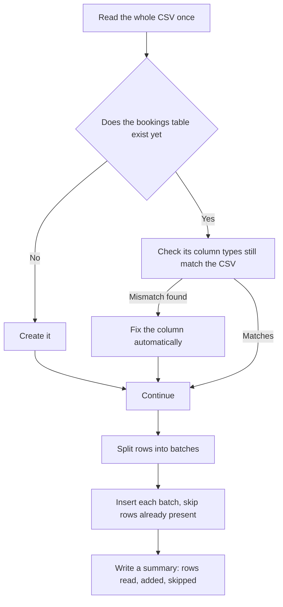

# The Incremental Loader

This explains what `scripts/incremental.py` does and why it is safe to run again and again.

## 1. What it does, in one sentence

It copies rows from `Bookings.csv` into the Postgres table `bookings`, and skips any row that is already there.

## 2. Why it is called incremental

`Booking_ID` is the table's primary key. Every load runs an insert that says "add this row, but if a row with this ID already exists, do nothing." So if you run the script daily on a refreshed CSV, only the rows that are actually new get added. Run it twice on the same file and the second run adds nothing, it just confirms everything is already there.

## 3. What happens on each run

## 4. Why the CSV is read in one pass, not in chunks

An earlier version read the CSV in chunks and let pandas guess each column's type separately per chunk. A column that is often blank, like `Time`, could come out as one type in an early chunk and a different type in a later one, which made Postgres reject the load with a type mismatch. Reading the whole file once first settles on a single, correct type per column before anything is written. The chunking that still happens later is only about how many rows get inserted per database call, it no longer affects what type each column is read as.

## 5. Self healing an existing table

If an older run already created `bookings` with a column set to the wrong type, the loader checks the live table against the correct schema before inserting anything, and fixes any mismatched column on its own instead of failing. It prints exactly what it changed, so nothing happens silently.

## 6. What a run looks like day to day

* CSV has no new rows: every row is already in the table, so the run inserts zero and skips everything, no duplicates.
* CSV has new rows: only those new rows get inserted.
* Safe to put on a schedule, cron, Airflow, or anything similar, since running it repeatedly never causes duplicates or errors.

## 7. Configuration

Everything is read from a `.env` file next to the script.

| Setting | What it controls |
|---|---|
| `POSTGRES_HOST`, `POSTGRES_PORT`, `POSTGRES_DATABASE`, `POSTGRES_USERNAME`, `POSTGRES_PASSWORD` | how to connect to Postgres |
| `CSV_FILE_PATH` | where `Bookings.csv` lives |
| `TABLE_NAME` | the target table, `bookings` by default |
| `CHUNK_SIZE` | how many rows go into each insert batch, `5000` by default |

## 8. What you see when it runs

The script prints a small banner, a progress bar while it loads, and a summary panel at the end showing rows in the table before the run, rows read from the CSV, rows newly added, rows skipped, and rows in the table after. Every run also writes a row to an `etl_load_log` table in Postgres, so there is a permanent record of every load: when it ran, how many rows it read, and how many were actually new.