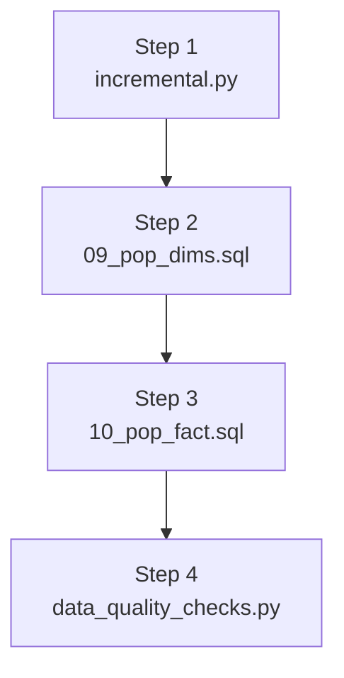

# The Pipeline Script

This explains what `ps1/pipeline.ps1` does and how to run it. It is the native Windows equivalent of the Docker entrypoint sequence, for anyone running the project without Docker.

## 1. What it does, in one sentence

It runs the loader, the two model population scripts, and the quality checks in order, and stops immediately if any step fails.

## 2. The four steps



`$ErrorActionPreference = "Stop"` plus an exit code check after every `psql` and `python` call means the script throws and stops at the first failing step. A broken load never quietly continues into the quality checks against bad or partial data.

## 3. Before you run it

The script needs `python` and `psql` reachable, and a database connection. It tries to find both on its own:

- `psql` is resolved from `$env:PSQL`, then whatever is on `PATH`, then common Windows install locations (EDB installer, Scoop, Chocolatey).
- Connection details (`PGHOST`, `PGPORT`, `PGDATABASE`, `PGUSER`, `PGPASSWORD`) are read from your session if already set, otherwise loaded from a `.env` file found near the project root or the script itself.
- `PGHOST`, `PGDATABASE`, and `PGUSER` are required. The script throws a clear error naming which one is missing if none of the above provide it.

## 4. Configuration

| Setting | What it controls |
|---|---|
| `PGHOST`, `PGPORT`, `PGDATABASE`, `PGUSER`, `PGPASSWORD` | database connection, read directly or mapped from `POSTGRES_*` values in a `.env` file |
| `PYTHON` | path to the Python executable, defaults to `python` on `PATH` |
| `PSQL` | path to `psql.exe`, searched automatically if not set |
| `SCRIPTS_DIR`, `MODEL_DIR`, `LOGS_DIR` | override the default `scripts/`, `model/`, and `logs/` folder locations |
| `ENV_FILE` | override which `.env` file gets loaded |

## 5. Running it

```powershell
cd ps1
.\pipeline.ps1
```

Override any setting inline before running, for example:

```powershell
$env:PGHOST="localhost"; $env:PGDATABASE="uber"; $env:PGUSER="postgres"; .\pipeline.ps1
```

## 6. Logging

Every run writes a fresh, timestamped log file to `logs/pipeline_YYYY-MM-DD_HH-mm-ss.log`, using the same line format as the Python loader's logger, so a run is never mixed in with a previous one and both are easy to read side by side.