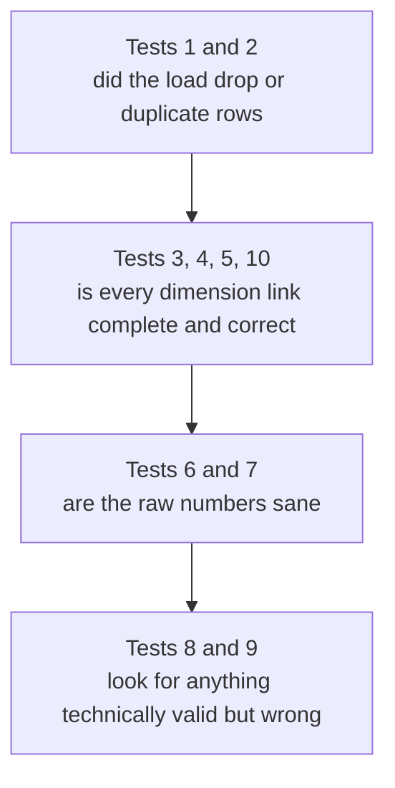

# ETL Data Quality Tests

This explains the 10 SQL checks that confirm data loaded correctly from the raw `bookings` table into the star schema (`fact_bookings` and the `dim_*` tables). Most of what these catch never throws an error. The load finishes, the script exits clean, and the numbers are just quietly wrong.

## Why bother testing a load at all

A load can succeed with no errors and still be wrong: a dashboard showing fewer bookings than it should, a rating that is not physically possible, a cancelled ride marked as completed. These tests catch that right after a load, instead of someone noticing weeks later that a report looks off.

## The five categories

| Category | Tests | Catches |
|---|---|---|
| Completeness | 1, 5 | Rows or dimension values that got dropped silently |
| Uniqueness | 2 | Duplicate loads |
| Referential integrity | 3, 4, 10 | Broken or missing links between fact and dimension tables |
| Value sanity | 6, 7 | Impossible numbers, negative values, ratings out of range |
| Business logic | 8, 9 | Numbers that are each valid on their own but do not agree with each other |

---

## Test 1: row count match

```sql
SELECT (SELECT COUNT(*) FROM bookings) AS source_count,
       (SELECT COUNT(*) FROM fact_bookings) AS fact_count;
```

Checks that the raw table and the fact table have the same number of rows. If `fact_count` is lower, rows were lost during the load, almost always because a join to a dimension table failed to match and silently dropped the row instead of erroring.

Expect: `source_count = fact_count`.

---

## Test 2: duplicate booking_id

```sql
SELECT booking_id, COUNT(*) AS cnt
FROM fact_bookings
GROUP BY booking_id
HAVING COUNT(*) > 1;
```

Checks that no `booking_id` appears twice. `booking_id` defines the grain of the fact table, one row per booking. If the load ever inserts instead of upserts, or the same file gets loaded twice, that booking gets counted twice in every report.

Expect: zero rows.

---

## Test 3: unexpected NULLs in foreign keys

```sql
SELECT 
    SUM(CASE WHEN date_key IS NULL THEN 1 ELSE 0 END) AS null_date,
    SUM(CASE WHEN vehicle_type_key IS NULL THEN 1 ELSE 0 END) AS null_vehicle,
    SUM(CASE WHEN payment_method_key IS NULL THEN 1 ELSE 0 END) AS null_payment,
    SUM(CASE WHEN booking_status_key IS NULL THEN 1 ELSE 0 END) AS null_status,
    SUM(CASE WHEN pickup_location_key IS NULL THEN 1 ELSE 0 END) AS null_pickup,
    SUM(CASE WHEN drop_location_key IS NULL THEN 1 ELSE 0 END) AS null_drop
FROM fact_bookings;
```

Counts how many fact rows are missing a key for each dimension. A NULL key almost always means the lookup could not find a matching dimension row, often a typo, extra whitespace, or different capitalization between the raw value and the dimension table (`"cash"` in `bookings` vs `"Cash"` in `dim_payment_method`).

Expect: all five counts at 0. `incomplete_reason_key` is not checked here on purpose, it is supposed to be NULL for any ride that was not cancelled or incomplete.

---

## Test 4: orphaned foreign keys

```sql
SELECT 'vehicle_type' AS dim, COUNT(*) AS orphaned
FROM fact_bookings f
LEFT JOIN dim_vehicle_type vt ON vt.vehicle_type_key = f.vehicle_type_key
WHERE f.vehicle_type_key IS NOT NULL AND vt.vehicle_type_key IS NULL
-- repeated for payment_method and date
```

Checks that every foreign key that is not NULL actually points to a row that exists. This is different from Test 3. A NULL key means the lookup failed and nothing got stored. An orphaned key means something got stored, but it points nowhere. This should not be possible while the foreign key constraints are active. It exists to catch it if those constraints were ever dropped or bypassed.

Expect: `orphaned = 0` for every dimension.

---

## Test 5: dimension completeness

```sql
SELECT 
    (SELECT COUNT(DISTINCT "Vehicle_Type") FROM bookings) AS distinct_vehicle_source,
    (SELECT COUNT(*) FROM dim_vehicle_type) AS rows_in_dim_vehicle,
    (SELECT COUNT(DISTINCT "Payment_Method") FROM bookings) AS distinct_payment_source,
    (SELECT COUNT(*) FROM dim_payment_method) AS rows_in_dim_payment,
    (SELECT COUNT(DISTINCT TO_CHAR("Date",'YYYYMMDD')) FROM bookings) AS distinct_date_source,
    (SELECT COUNT(*) FROM dim_date) AS rows_in_dim_date;
```

Checks that the number of distinct values in the raw data matches the number of rows in the matching dimension table. Dimensions are usually built by scanning the raw data for distinct values. If that step ever stops picking up new values, the dimension quietly falls behind, and Test 3 or Test 4 will fail downstream. This test catches the gap directly, at the dimension itself.

Expect: each source count equals the matching dimension row count. Fewer rows in the dimension than distinct values in the source means something never made it in.

---

## Test 6: no negative measures

```sql
SELECT COUNT(*) AS invalid_measure_rows
FROM fact_bookings
WHERE booking_value < 0 OR ride_distance < 0 OR v_tat < 0 OR c_tat < 0;
```

Checks that fare, distance, and turnaround time are never negative. These are real world quantities that cannot logically go below zero. A negative value points to a data type problem or corrupted source data.

Expect: 0 rows.

---

## Test 7: rating range

```sql
SELECT COUNT(*) AS invalid_rating_rows
FROM fact_bookings
WHERE (customer_rating IS NOT NULL AND (customer_rating < 1 OR customer_rating > 5))
   OR (driver_ratings IS NOT NULL AND (driver_ratings < 1 OR driver_ratings > 5));
```

Checks that every rating that is not NULL falls between 1 and 5. Anything outside that range is not physically possible on this platform, and usually means a placeholder value like `0` or `-1` got treated as a real rating instead of NULL.

Expect: 0 rows.

---

## Test 8: booking status and flag consistency

```sql
SELECT bs.booking_status, 
    SUM(CASE WHEN f.canceled_by_customer_flag THEN 1 ELSE 0 END) AS flagged_canceled_by_customer,
    SUM(CASE WHEN f.canceled_by_driver_flag THEN 1 ELSE 0 END) AS flagged_canceled_by_driver,
    SUM(CASE WHEN f.incomplete_rides_flag THEN 1 ELSE 0 END) AS flagged_incomplete
FROM fact_bookings f
JOIN dim_booking_status bs ON bs.booking_status_key = f.booking_status_key
GROUP BY bs.booking_status
ORDER BY bs.booking_status;
```

Checks whether the boolean flags on each row agree with what the row's status says. This is a business logic check, not a data type check, every value here could be technically valid and still be wrong together. A row marked `Completed` should have all three flags false. If it does not, the transform has a logic bug in how it derives those flags.

Expect: no flags set to true under a clean status like `Completed`. Read this one by eye, it is not a single pass or fail number.

---

## Test 9: date range sanity check

```sql
SELECT MIN(d.full_date) AS min_date, MAX(d.full_date) AS max_date, COUNT(DISTINCT d.full_date) AS distinct_days
FROM fact_bookings f
JOIN dim_date d ON d.date_key = f.date_key;
```

Shows the actual date range covered by the fact table. There is no fixed pass or fail condition, compare it against what you already know the source file should cover. A date far outside the expected range usually means a date parsing bug, for example reading `DD/MM/YYYY` as `MM/DD/YYYY`.

Expect: `min_date` and `max_date` match the known range of the source file.

---

## Test 10: pickup and drop location check

```sql
SELECT 'pickup' AS role, COUNT(*) AS unmatched
FROM fact_bookings f
LEFT JOIN dim_location l ON l.location_key = f.pickup_location_key
WHERE f.pickup_location_key IS NOT NULL AND l.location_key IS NULL

UNION ALL

SELECT 'drop', COUNT(*)
FROM fact_bookings f
LEFT JOIN dim_location l ON l.location_key = f.drop_location_key
WHERE f.drop_location_key IS NOT NULL AND l.location_key IS NULL;
```

Same idea as Test 4, but specifically for `dim_location`, since it is a role playing dimension used twice on the fact table, once for pickup and once for drop. It is easy for a transform to correctly join one role and forget the other, so both are checked separately.

Expect: `unmatched = 0` for both `pickup` and `drop`.

---

## Suggested order to run these in



If the first two groups are not clean, do not bother interpreting the rest yet. A broken join upstream can make later numbers look wrong for reasons that have nothing to do with the actual data.